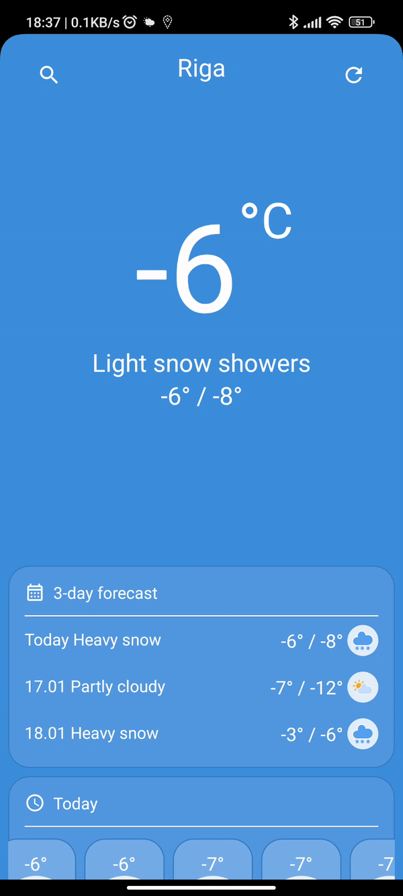
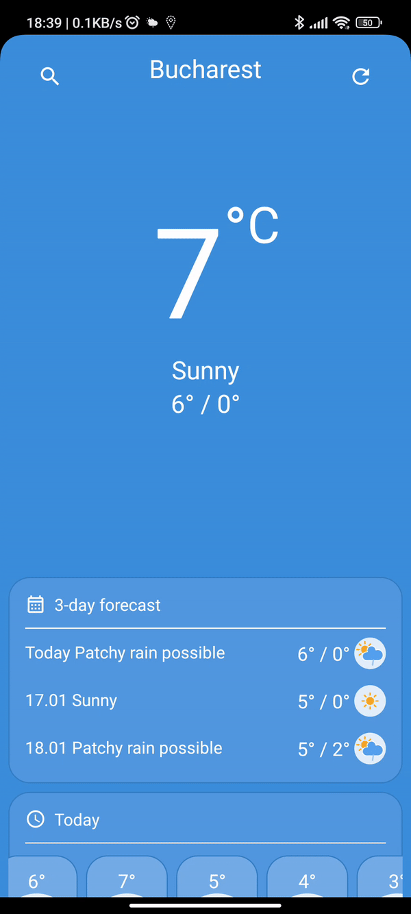

# CommonWeather
⛈ Weather app with WeatherApi API.  Here i demonstrate the use of Modern Android development tools

## Screenshots

**Please click the image below to enlarge.**

## Technologies used 🛠:

- Clean architecture + Mvi pattern
- Modularization
- Dagger 2
- Coroutines + Flows
- Room
- Retrofit
- Navigation component
- Widget
- Work manager
- Alarm manager
- Notification manager
- Broadcast receiver
- DataStore
- Yandex MapKit SDK
- Android Architecture Components

[Download APK](https://github.com/MaslovAleksei/CommonWeather/releases/download/v0.1/CommonWeather.apk)

